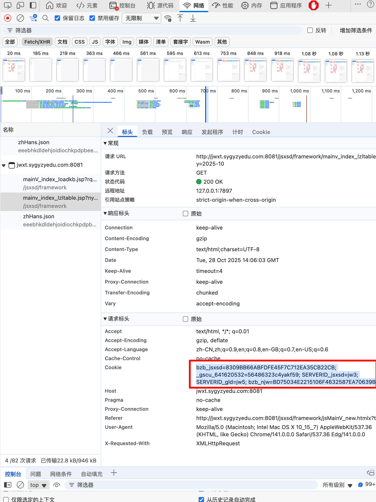

# course_pull
爬取邵工强志系统的课程表信息
本爬虫工具和同步工具由 Rust 语言开发，请安装Rust环境后使用

## 安装 Rust
```bash
curl --proto '=https' --tlsv1.2 -sSf https://sh.rustup.rs | sh
```

## 设置环境变量
``` bash
export MYSQL_URL_PROD=mysql://user_name:user_password@ip_address:ip_port/database_name
export MYSQL_URL_DEV=mysql://user_name:user_password@ip_address:ip_port/database_name
```

## 编译代码
```bash
cargo build
```

## 使用方法
```bash
Usage: course_pull [OPTIONS]

Options:
  -c, --cookie <COOKIE>                The cookie to use
  -p, --clipboard-cookie               The url to use
  -e, --env <ENV>                      The env to use, [prod|dev] [default: dev]
  -v, --mysql-version <MYSQL_VERSION>  The mysql version to use [default: 1.1.1]
  -h, --help                           Print help
  -V, --version                        Print version

# 默认使用开发环境
cargo r -- -c "cookies_str"

# 使用生产环境
cargo r -- -c "cookies_str" -e prod

# 使用生产环境，并且指定mysql版本
cargo r -- -c "cookies_str" -e prod -v 1.1.1

# 使用生产环境，并且指定mysql版本，并且使用剪贴板cookie
cargo r -- -e prod -v 1.1.1 -p

# 例：指定 cookie,然后同步到开发环境
cargo r -- -c "bzb_jsxsd=8309BB66ABFDFE45F7C712EA35CB22CB; _gscu_641620532=56486323c4yakf59; SERVERID_jsxsd=jw3; SERVERID_gld=jw5; bzb_njw=BD75034E2215106F4632587EA70639B1"
```

## 注意事项
请设置正确的环境变量，否则无法连接到数据库

## 附录
获取 Cookies 的方法
1. 打开浏览器，登录邵工强志系统
2. 打开开发者工具，选择 Network
3. 刷新页面，找到登录请求
4. 复制请求头中的 Cookie 字段


